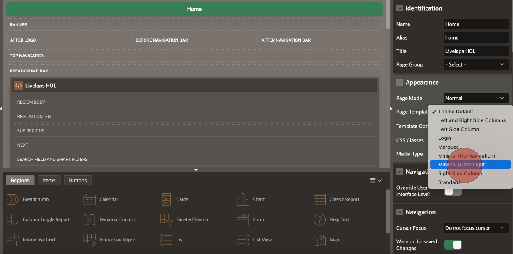
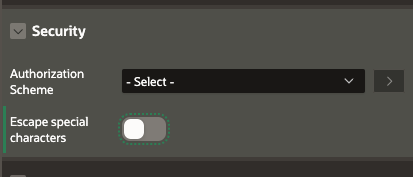
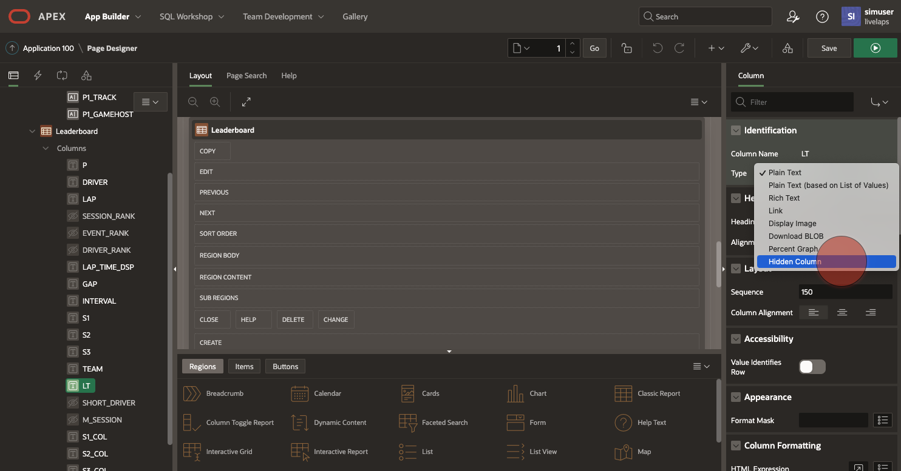
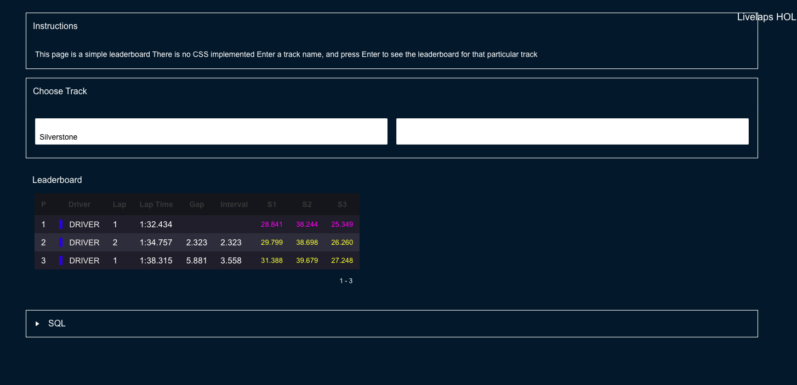
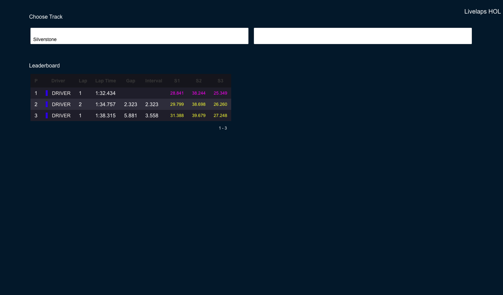

# Import and customize Oracle APEX app

## Introduction
In this section, we will be discussing the creation of a presentation layer for our eSports data. To accomplish this, we will be utilizing Oracle's Lowcode environment known as APEX. APEX is an extremely powerful tool that simplifies and accelerates the development lifecycle due to its What-You-Write-Is-What-You-Get (WYWASIG) interface.

Throughout this section, we will explore how to import an application into APEX and personalize it using CSS and SQL conditional formatting. This will allow us to create a visually appealing and user-friendly interface for our eSports data, making it easily accessible and understandable for anyone who needs to interact with it. With APEX, we can streamline the development process and focus on delivering a top-quality product that meets the needs of our users.

Estimated Time: 20 minutes

### Objectives

In this lab, you will learn how to:
* Import APEX app
* Use CSS to customize the look

### Prerequisites
This lab assumes you have:
* An Oracle Cloud account
* All previous labs successfully completed
* APEX workspace login details

### What is an APEX Workspace?
An APEX Workspace is a logical domain where you define APEX applications. Each workspace is associated with one or more database schemas (database users) which are used to store the database objects, such as tables, views, packages, and more. These database objects are generally what APEX applications are built on top of.

## Task 1: Install custom app in Oracle APEX

1. Download "Formula-Pi" APEX app [files](files/apexapps.zip)

2. Click on _hamburger menu_ and select _APEX Workspaces_  
     
        (optional) You can navigate to _APEX Workspaces_ from "DB Actions" homepage  
          
        (optional) You can navigate to _APEX Workspaces_ from "Oracle Cloud Console"      
          
3. Log in to your Oracle APEX instance.  
   
4. Click _App Builder_ > _Import_  

1.  Drag and drop f199.sql into the dotted box

1.  Click _Next_ to import the file
   
2.  Click _Next_ for install options
3.  Leave all others as default
4.  Click _Install Application_
   

### Access your APEX app
8.  Click _Run_ Application
   
9.  Sign in as APEX user “F1_HOL”  

1.  In the “Track” form field enter the name of the track that you have been racing on. This is the name of the track that the Game sets. Press Enter
2.  A simple Leaderboard report is created  

1.  You can view the SQL used to create the Leaderboard in the footer region, or by editing the page
2.  Explanation of the SQL:
    1.  Extracts Laptime data based on the track you selected in the form. The data is then ranked and formatted for display.
    2.  Extract Laptime Data: Selects the Lap Timing from the “F1SIM-LAPTIME” table, including the Session data and filters based on the Selected Track (:p1_track) on the Game Version being 2022 and only Valid Laps.
    3.  Rank Lap times: Lap times have 3 rankings in this case
    4.  Session Rank. If you do 5 laps in one “session”, this will be the order of the timing for that session only.
    5.  Event Rank. This will be a ranking for ALL sessions for each Gamehost.
    6.  Driver Rank provides a ranking of laptimes for a given driver’s name. In this case we are defaulting to “Driver” (and Team Name).
    7.  To update the Leaderboard report and leverage the Ranking as a filter, you can set the WHERE clause here: (Un comment the WHERE)

The next section formats the Fields for display. Laptimes are in Milliseconds and need to be converted to Minutes:Seconds.Milliseconds. Sector Times are formatted to 3 decimal places. Gap & Interval are calculated based on the time difference between the fastest time (GAP) and the previous time (INTERVAL).

## Task 2: Add CSS to Application

### Duplicate core App
1. 	Click to Edit the Application from the App Builder page
1. 	Click _Copy this Application_

2. 	Add Name : ***Livelaps HOL+CSS***
3. 	Click _Next_  

4. 	Click _Copy Application_  

1. 	New Application is loaded into the App Builder Edit Application Page
### Upload CSS files
1. 	Click _Shared Components_

1. 	Click _Static Application Files_ under “Files and Reports”

1. Click _Create File_
2. 	Drag or Choose “apex-hol-min.css”

1. 	You can review the CSS here, but for now click _Save Changes_ and back to _Static Application Files_

1. 	Repeat same process for “Livelaps HOL.css”

1. Great Work! Note that APEX created ***MIN*** version of the Livelaps HOL css file.

1. Please copy or make note of following two URL's - we will need them later.
   - ***apex-hol-min.css*** file. URL =`#APP_IMAGES#apex-font-min.css`
   - ***LiveLaps HOL.css*** file. URL = `#APP_FILES#Livelaps HOL.css`

## Task 3:  Apply CSS Template to your app
1. 	From Shared Components Screen click _Themes_ under “User Interface”

2. 	Click _Universal Theme – 42*_ to edit the Theme

3. 	Click Styles

4. 	Click Add Style

5.  Enter following details:
   - Name: `eSports`
   - Is Current. Switch ON
   - Add CSS `#APP_IMAGES#apex-font-min.css` to File URLs
1. 	Click Create
   
2.  Click Apply Changes
   

## Task 4: Changing App formatting to our Custom CSS
1. 	Click _Shared Components_  
    
2. 	Click _User Interface Attributes_ under “User Interface”
    
3. 	Scroll to CSS and enter the Reference (URL) into the File URLs box: `#APP_FILES#Livelaps HOL.css`
    
4. 	Click _Apply Changes_
1. Click _Run_  to see how our dashboard looks now


## Task 5: Styling our Leaderboard App
1. From the Edit Application in the App Builder page
2. 	Select Page _1 – Home_ to open in Edit Mode

3. 	Set the Page Template under “Appearance” to be Minimal (Ultra light) from the drop down. This selects our minimal custom page template

Next, set the Page style to be our eSports theme (from inside the Livelaps HOL css file)
1. 	In the CSS Classes under “Appearance” enter eSports
2. 	Click Save

    Some tweaks to tidy up the Page.
    We don’t need a Breadcrumb bar, so this can be deleted
    1. 	Select Livelaps HOL under Breadcrumb Bar and delete it (right click > delete, or press delete key)
    2. 	Click Save

## Task 6: Implementing dynamic CSS to our Leaderboard App
To format the Leaderboard let's include CSS inside our SQL. We can use conditional formatting in the SELECT statement and use columns as CSS directives.
1. Let’s update the SQL

        ```
        <copy>SELECT DISTINCT RANK() OVER (ORDER BY lt) P,M_SESSION, M_LAP LAP, LT,session_rank, event_rank, driver_rank, short_driver,team,  
        to_char(extract(MINUTE FROM numtodsinterval(LT/1000, 'SECOND')), 'fm0') || ':' || to_char(extract(SECOND FROM numtodsinterval(LT/1000, 'SECOND')), 'fm00.000') lap_time_dsp,
        to_char(S1/1000, 999.999) S1, to_char(S2/1000, 999.999) S2, to_char(S3/1000, 999.999) S3,
        CASE WHEN (LT- (MIN(LT) OVER ()))  = 0 THEN  ''
        ELSE to_char((LT- (MIN(LT) OVER () ))/1000, '999.999') END as gap,
        CASE WHEN NVL((LT - lag(lt,1) OVER (ORDER BY lt))/1000, 0)  = 0 THEN  ''
        ELSE to_char(NVL((LT - lag(lt,1) OVER (ORDER BY lt))/1000, 0), '999.999') END as interval, 
        CASE WHEN S1 > min(S1) OVER () THEN    'time-yellow' ELSE    'time-purple' END as s1_col,
        CASE WHEN S2 > min(S2) OVER () THEN    'time-yellow' ELSE   'time-purple' END as s2_col,
        CASE WHEN S3 > min(S3) OVER () THEN    'time-yellow' ELSE   'time-purple' END as s3_col,
        '<span class="l_vert txt-' || TEAM ||'"></span><span class="drivern txt-wht u-textUpper hidden-md-down">&nbsp;' || DRIVER || '</span><span class="drivern txt-wht u-textUpper hidden-lg-up">&nbsp;' || SHORT_DRIVER || '</span>' Driver
        FROM 
        (
        SELECT l.M_SESSION, l.M_GAMEHOST, l.TRACKID, l.M_LAP M_LAP, l.S1, l.S2, l.S3, l.LT,
        RANK() OVER (PARTITION BY l.m_session ORDER BY LT) session_rank,
        RANK() OVER (PARTITION BY l.m_gamehost ORDER BY LT) event_rank,
        RANK() OVER (PARTITION BY 'driver' ORDER BY LT) driver_rank,
        'Driver' driver, 'DRI' SHORT_DRIVER, 'rbr' team,  0 R_STATUS
        FROM (
            SELECT l."DATA$m_session" M_SESSION,
            l."DATA$m_gamehost" M_GAMEHOST,
            l."DATA$m_trackid" TRACKID,
            l."DATA$lap_num" M_LAP,
            l."DATA$sector1_in_ms" S1,
            l."DATA$sector2_in_ms" S2,
            l."DATA$sector3_in_ms" S3,
            l."DATA$lap_time_in_ms" LT
            FROM "F1SIM-LAPTIME" l
            WHERE 
            l."DATA$m_trackid" = :P1_TRACK  -- Filter by Track
            AND l."DATA$m_packet_format" = 2022  -- Filter by Game Version
            AND l."DATA$invalid_lap" = 0 -- Filter by Valid Laps (0) or remove alltogether for ALL laps
        ) l
        )
        --WHERE driver_rank =1 -- Add for only 1 record per driver (name)
        ORDER BY P
        FETCH FIRST 20 ROWS ONLY;</copy>
        ```
1. Click on _Leaderboard_ and paste above SQL statement into _Source_ > _SQL Query_ (Right hand side of your screen)
  
1. 	Expand Leaderboard Region _Columns_  
  
1. 	Click _DRIVER_ column
2. 	Scroll to Escape Special Characters under “Security” and switch OFF  
  
1. 	Click _S1_ Column
2. 	Scroll to HTML Expression under “Column Formatting” and use this code:
        ```
        <copy><span class="laptime #S1_COL#">#S1#</span></copy>
        ```
3. Repeat for _S2_ and _S3_ Columns  
- ***S2***: 
        ```
        <copy><span class="laptime #S2_COL#">#S2#</span></copy>
        ```
- ***S3***:
        ```
        <copy><span class="laptime #S3_COL#">#S3#</span></copy>
        ```  
    
1. Click _Save_
   
We don’t need all the columns in our Leaderboard, so go ahead and Hide (or delete) the following:  
    - Hide LT and Team  
    - Hide "S1_COL", "S2_COL", "S3_COL"  
      
You can re-run your Leaderboard App to see what progress you made! ***Don’t forget to set your chosen track***  
      


## Task 6: Tidy up - Let's get rid of the Gridline. 
1. From the Edit Application in the App Builder page
2. 	Select Page _1 – Home_ to open in Edit Mode

2. 	Click the Leaderboard Region
3. 	Scroll down to “Appearance” section and click on _Template Options_ button  

4. 	Click Style Drop Down and choose “Remove Borders”. Click _OK_

5. 	With Leaderboard Region still selected, click Attributes Tab

1. 	Click _Template Options_ button under “Appearance” to open the options popup
2. 	Set Row Highlighting to _Disable_

1. 	Set Report Border to _No Borders_
2.  Click _OK_
3.  Click _Save_
4.  Done! Run your dashboard!
   

## Summary

This completes the labs. WELL DONE!

## Acknowledgements

 - **Author/Contributors** -  Stuart Coggins, Wojciech Pluta, Jason Lowe
 - **Contributor** - Oracle LiveLabs Team
 - **Last Updated By/Date** - Madhusudhan Rao, Apr 2022
